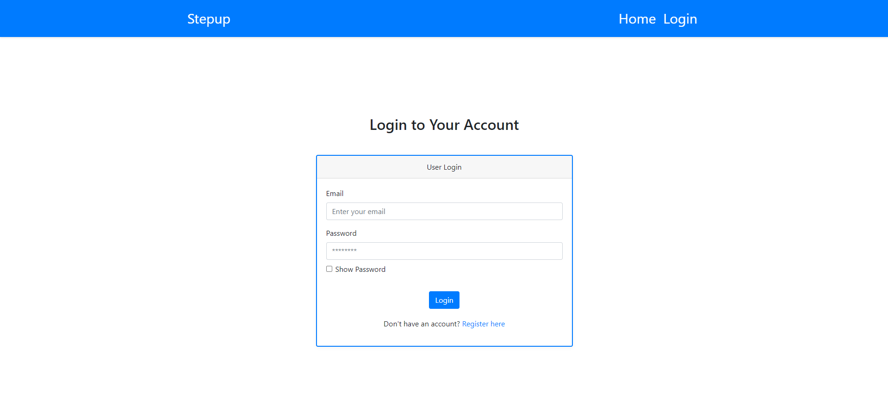
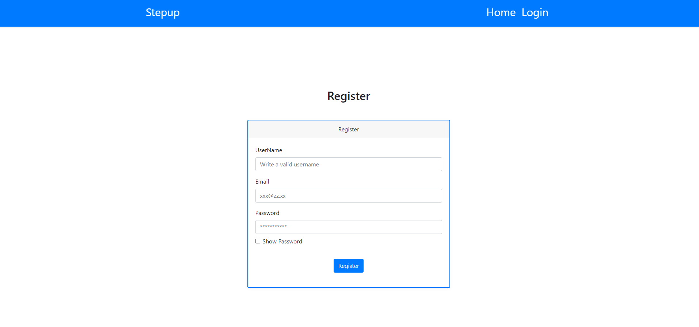
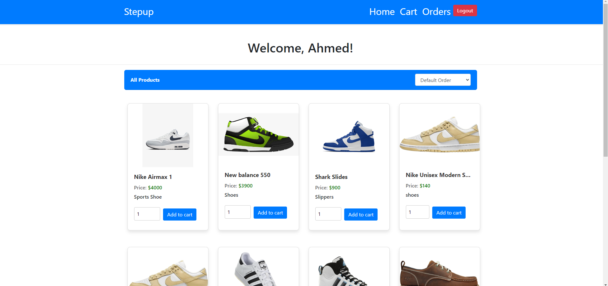
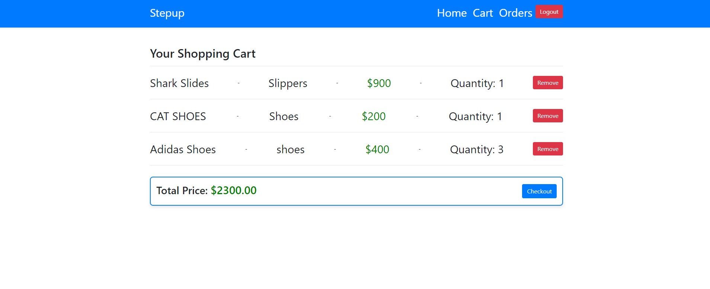
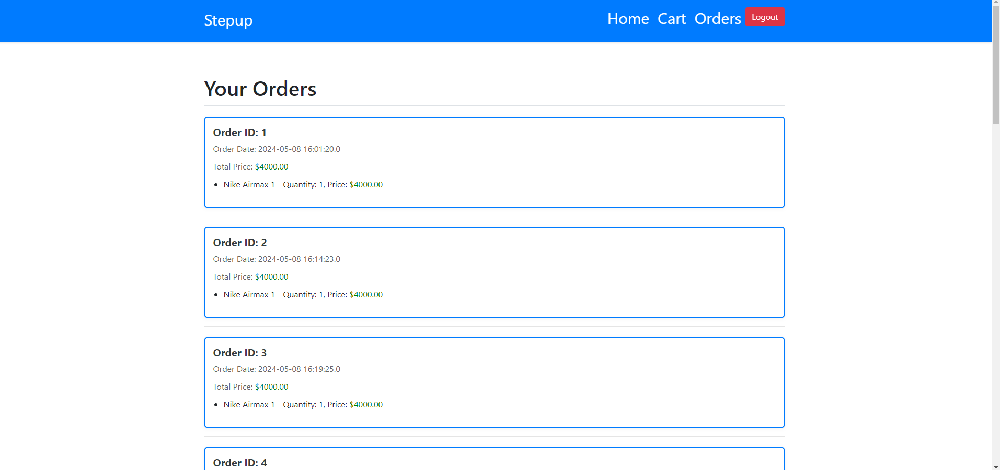
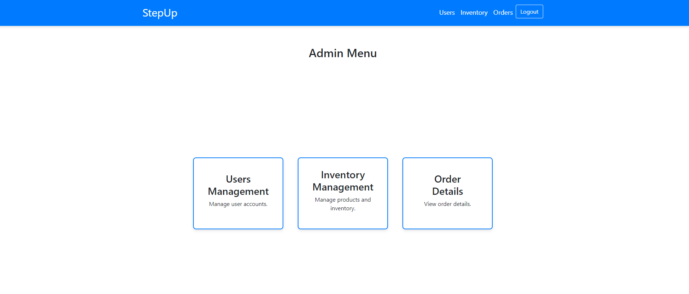
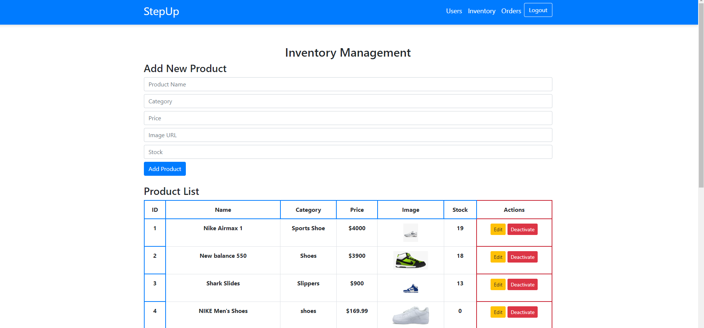
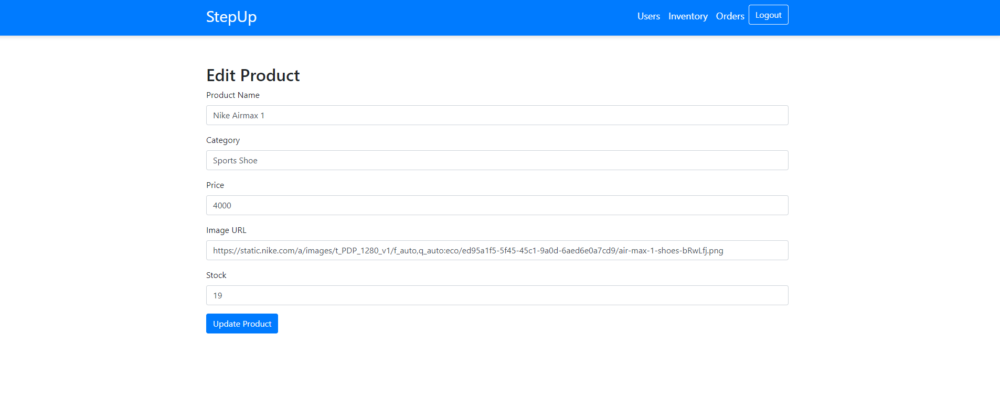
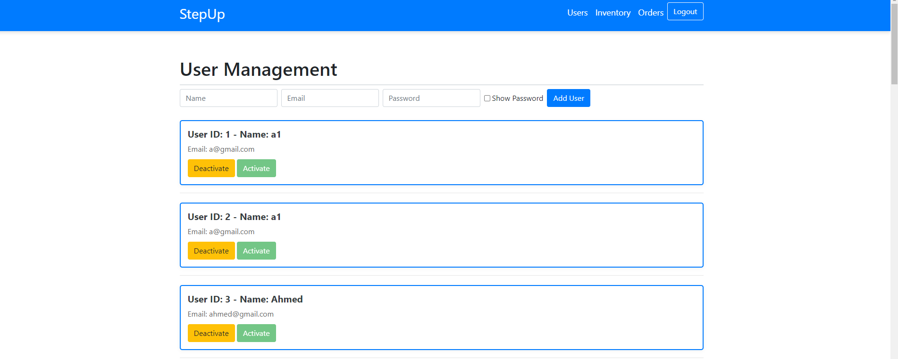
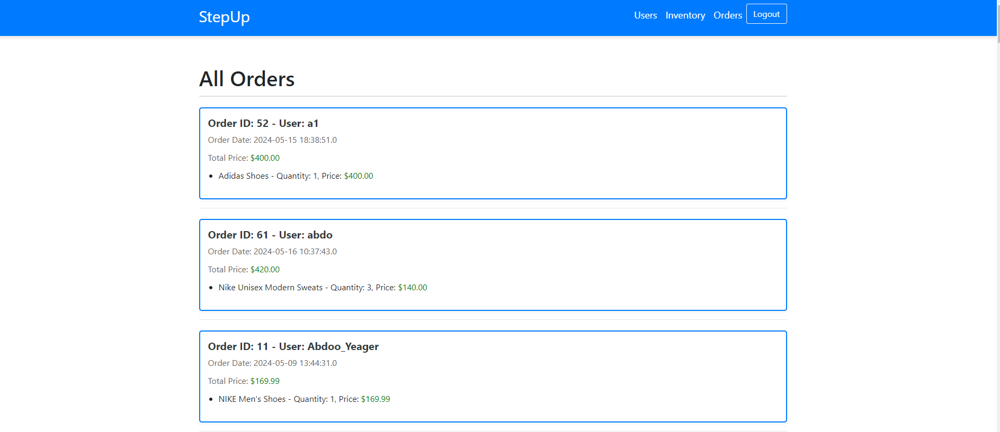

# StepUp E-Commerce Platform

StepUp is a comprehensive e-commerce platform designed to manage products, orders, and users. This platform includes functionalities for users to browse products, add items to the cart, and proceed to checkout. Additionally, administrators have the ability to manage inventory, view order details, and manage user accounts.

## Features

### User Features

- **Product Browsing**: Users can browse products categorized into different sections.
- **Shopping Cart**: Users can add products to the shopping cart, view the cart, and proceed to checkout.
- **Order Management**: Users can view their past orders and order details.
- **User Authentication**: Secure login and registration system.
- **Cookies**: The platform uses cookies to store some info about the session. (Not that important)
- **Email Notifications**: Users receive email notifications upon successful registration and order placement.

### Admin Features

- **Inventory Management**: Admins can add, edit, activate/deactivate products, and manage stock levels.
- **User Management**: Admins can view user details, and activate/deactivate user accounts.
- **Order Management**: Admins can view detailed order information, including user details and order items.

## Technologies Used

- **Java**: Backend logic and servlet handling.
- **Jakarta EE**: Servlet implementation.
- **JSP**: Dynamic web pages.
- **Bootstrap**: Frontend framework for responsive design.
- **MySQL**: Database for storing user, product, and order information.
- **Maven**: Project management and dependency management.
- **GitHub**: Version control and repository hosting.

## Installation

### Prerequisites

- Java Development Kit (JDK) 21 or higher
- Apache Tomcat 9 or higher
- MySQL Server
- Maven
- Git

### Setup Instructions

1. **Clone the repository**:
    - Download the project folder.
    - Run using `Eclipse` IDE (Recommended).
    - Make sure that you match all the `prerequisites` for safe running.
2. **Set up the database**:
    - Create a MySQL database named `stepup`.
    - Import the provided SQL schema to set up the required tables.
    - Update the database connection details in the `DB.java` file.
3. **Configure Email Settings**:
    - Replace the email host in the `EmailUtility.java` file with your own email credentials.

## Screenshots

### Login & Registration Pages

### Product List (Home)

### Shopping Cart

### User orders Cart

### Admin Menu

### Admin Inventory Management

### Admin Edit Product

### Admin User Management

### Admin Orders Display

## Usage Notes

- **Cookies**: The platform uses cookies to store some data that does not affect the session. Ensure cookies are enabled in your browser for a seamless experience.
- **Email Notifications**: The platform sends email notifications for login confirmation. Update the email host and credentials in `EmailUtility.java` for this feature to work.

## Contributing

Contributions are welcome! Please fork the repository and create a pull request with your changes.

## License

This project is licensed under the MIT License.
